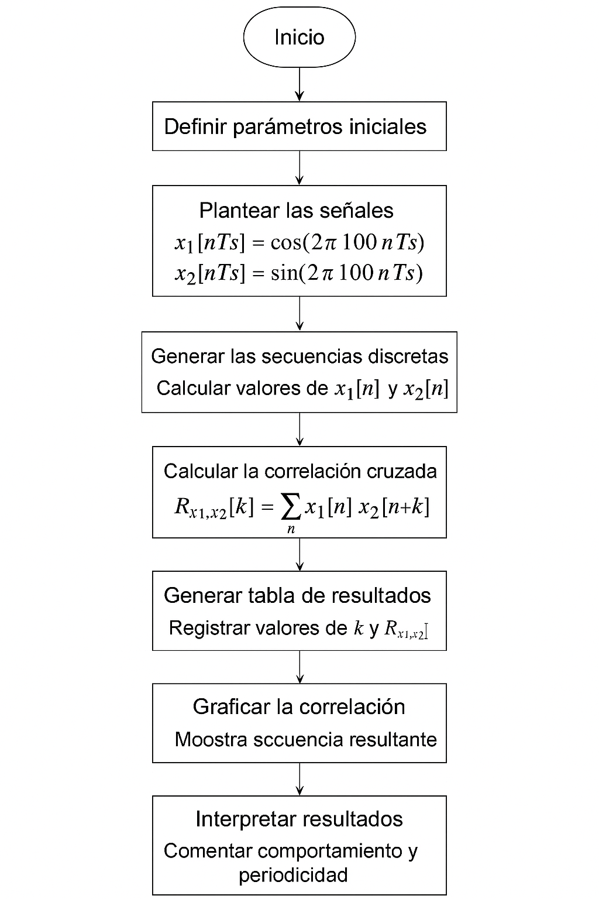
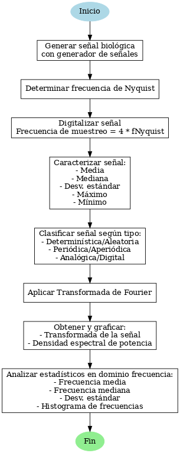

# Laboratorio-2-Procesamiento
## Introducción
En esta práctica de laboratorio se estudiaron tres herramientas fundamentales para el procesamiento digital de señales: la convolución, la correlación y la transformada de Fourier. Estas operaciones permitieron analizar el comportamiento de las señales o conjunto de señales tanto en el dominio del tiempo como en el dominio de la frecuencia. Asimismo, realizamos el análisis de una señal de electrooculografía generada con ayuda del generador biológico de señales. 
## Importación de librerias 
Para el desarrollo de esta práctica se instalaron las siguientes librerías:
```python
!pip install wfdb
import matplotlib.pyplot as plt
import numpy as np
import wfdb
import pandas as pd
import os
from scipy.stats import norm
import seaborn as sea
from scipy.fft import fft, fftfreq
from scipy.signal import welch
```
La librería `wfdb` se utilizó para la lectura y manipulación de las señales biológicas. `Matplotlib` y `Seaborn`  se usaron para la representación gráfica y visualización de datos. `NumPy` y `Pandas` facilitaron el manejo de arreglos numéricos y estructuras de datos. El módulo `os` permitió la gestión de archivos dentro del entorno de trabajo. Asimismo, `scipy.stats.norm` se aplicó para análisis estadístico, mientras que las funciones de `scipy.fft` y `scipy.signal.welch` se usaron para la obtención de la transformada de Fourier, el cálculo de frecuencias y la estimación espectral de potencia de las señales. 
## PARTE A
En la Parte A del laboratorio se trabajó con un sistema discreto h[n] y una señal de entrada x[n], definidos a partir de los dígitos de nuestros códigos y cédulas respectivamente. El objetivo fue aplicar la operación de convolución para obtener la señal de salida y[n]. A continuación, se muestra el diagrama de flujo que describe cada paso de esta parte del laboratorio.
<p align="center">


## Señal y[n] resultante de la convolución:

1. Representación gráfica y secuencial (a mano) de y[n]:
<p align="center">

<p align="center">


2. Representación gráfica y secuencial (en Phyton) de y[n]:

El código que se muestra a continuación, calcula la convolución entre dos señales utilizando la función `np.convolve()` de` NumPy`.

Primero, se definen dos listas, `h[n]` (código) y `x[n]` (cédula), que representan la respuesta al impulso de un sistema y una señal de entrada, respectivamente. Luego, se aplica la convolución entre estas dos señales usando `np.convolve(x, h,)`, lo que genera una nueva señal producto de multiplicar y sumar los valores de las señales iniciales. 


```python
#Definimos h[n] y x[n]

#Juan
h1=[5,6,0,0,7,8,7]
x1=[1,0,5,7,5,7,6,1,6,9]
y1=np.convolve(x1,h1)

#Kevin
h2=[5,6,0,0,7,5,8]
x2=[1,0,2,3,1,6,3,4,7,5]
y2=np.convolve(x2,h2)

#Ralf
h3=[5,6,0,0,8,3,3]
x3=[1,0,1,9,9,8,6,0,3,6]
y3=np.convolve(x3,h3)
```
Ahora para graficar: Inicialmente se generan los índices `n` para que cada punto tenga una posición ordenada en la gráfica, esto con la función `np.arange(len(h1))`. Luego se crea una figura de 8x8 con `plt.figure(figsize=(8,8))`, se hacen tres subgráficas con la función `plt.subplot(3,1,1)` y finalmente se muestran las tres gráficas juntas con `plt.show()`. Se repiten estos pasos dos veces más para obtener las demás gráficas.

```python
#GRÁFICAS JUAN

n1 = np.arange(len(h1))
n2 = np.arange(len(x1))
n3 = np.arange(len(y1))

plt.figure(figsize=(8,8))

#Código: 
plt.subplot(3,1,1) 
plt.stem(n1,h1)
plt.title("Código Juan")
plt.ylabel("Amplitud")
plt.grid(True)

#Cédula: 
plt.subplot(3,1,2) 
plt.stem(n2,x1)
plt.title("Cédula Juan")
plt.ylabel("Amplitud")
plt.grid(True)

#Convolución:
plt.subplot(3,1,3) 
plt.stem(n3,y1)
plt.title("Convolución")
plt.ylabel("Amplitud")
plt.grid(True)

plt.show()

#GRÁFICAS KEVIN
n1 = np.arange(len(h2))
n2 = np.arange(len(x2))
n3 = np.arange(len(y2))

plt.figure(figsize=(8,8))

#Código: 
plt.subplot(3,1,1) 
plt.stem(n1,h2)
plt.title("Código Kevin")
plt.ylabel("Amplitud")
plt.grid(True)

#Cédula: 
plt.subplot(3,1,2) 
plt.stem(n2,x2)
plt.title("Cédula Kevin")
plt.ylabel("Amplitud")
plt.grid(True)

#Convolución:
plt.subplot(3,1,3) 
plt.stem(n3,y2)
plt.title("Convolución")
plt.ylabel("Amplitud")
plt.grid(True)

plt.show()

#GRÁFICAS RALF
n1 = np.arange(len(h3))
n2 = np.arange(len(x3))
n3 = np.arange(len(y3))

plt.figure(figsize=(8,8))

#Código: 
plt.subplot(3,1,1) 
plt.stem(n1,h3)
plt.title("Código Ralf")
plt.ylabel("Amplitud")
plt.grid(True)

#Cédula: 
plt.subplot(3,1,2) 
plt.stem(n2,x3)
plt.title("Cédula Ralf")
plt.ylabel("Amplitud")
plt.grid(True)

#Convolución:
plt.subplot(3,1,3) 
plt.stem(n3,y3)
plt.title("Convolución")
plt.ylabel("Amplitud")
plt.grid(True)

plt.show()
```
En resumen, el código toma una señal de entrada (cédula) y la pasa por un sistema definido por h[n] (código). Luego, mediante convolución, se calcula la salida y todo se grafica. De esto se obtuvieron las siguientes gráficas: 

<p align="center">

  

<p align="center">


<p align="center">


## PARTE B
<p align="center">

  
Para la parte B, el objetivo es calcular la correlacion cruzada entre las señales x1[n] y x2[n]. para comenzar se activa el formato de impresion en LaTeX con:
```python
init_printing(use_latex=True)
```
Luego se define el periodo de muetreo y el vector de indices, que genera las nueve muetras de n=0 hasta n=8.
```python
Ts = 1.25e-3
n = np.arange(9)
```
Con los parametros listos, se construyen las dos secuencias discretas para la señal del coseno y la señal del seno, ambas de 100Hz.
```python
X1 = np.cos(2*np.pi*100*n*Ts)
X2 = np.sin(2*np.pi*100*n*Ts)
```
Una vez generada las señales, se calcula la correlacion cruzada. Primero se obtiene la longitud de la secuencia con `N = len(X1)` y se define el rango de retardos `lags = np.arange(-N+1, N)`, que va de –8 a +8. Luego se recorre cada retardo k en un bucle. Para cada `k`, se acumulan los productos `X1[i] * X2[i + k]` siempre que el índice desplazado `i + k` esté dentro de los límites de la señal. Cada suma se agrega a la `lista r_manual`, que finalmente se convierte en un arreglo de NumPy.
```python
N = len(X1)
r_manual = []
lags = np.arange(-N+1, N)
for k in lags:
    suma = 0
    for i in range(N):
        if 0 <= i + k < N:
            suma += X1[i] * X2[i + k]
    r_manual.append(suma)

r_manual = np.array(r_manual)
```
Se muestran las secuencias y la correlación cruzada. Se imprimen los valores de `X1[n], X2[n]` y `r_manual` redondeados a cinco decimales con `np.round(...,5)` y se presentan en forma de matriz usando `display(Matrix(...))`. Esta parte representa la etapa Generar la tabla de resultados del diagrama de flujo, permitiendo ver claramente las dos señales y la secuencia de correlación obtenida.
```python
print("X1[n]:")
display(Matrix(np.round(X1,5)))
print("\n")

print("X2[n]:")
display(Matrix(np.round(X2,5)))
print("\n")

print("Correlacion cruzada:")
display(Matrix(np.round(r_manual,5)))
```
Finalmente para visualizar la secuencia resultante se utiliza un diagrama de tipo "stem", que muestra los valores de la correlacion para cada retardo.
```python
plt.stem(lags, r_manual)
plt.xlabel("Retardo k")
plt.title("Correlacion cruzada")
plt.grid(True)
plt.show()
```
<p align="center">

  
## PARTE C

<p align="center">


Para la adquisición de la señal EOG se empleó el código suministrado, el cual hace uso de la librería `nidaqmx`, encargada de gestionar la comunicación con los dispositivos NI DAQ para registrar señales analógicas. En dicho código se establecen el canal de entrada analógica, la frecuencia de muestreo de 800 Hz, garantizando el cumplimiento del criterio de Nyquist y el periodo, es decir, el tiempo de adquisición que fue de 5 segundos. Posteriormente, se efectúa una lectura finita de las muestras y la señal se almacena en un vector. Finalmente, se genera una gráfica que representa la señal en función del tiempo, lo que permite observar la EOG en formato digital lista para su análisis posterior.

```python

Librería de uso de la DAQ
!python -m pip install nidaqmx     

Driver NI DAQ mx
!python -m nidaqmx installdriver   

Created on Thu Aug 21 08:36:05 2025
@author: Carolina Corredor
"""

# Librerías: 
import nidaqmx                     # Librería daq. Requiere haber instalado el driver nidaqmx
from nidaqmx.constants import AcquisitionType # Para definir que adquiera datos de manera consecutiva
import matplotlib.pyplot as plt    # Librería para graficar
import numpy as np                 # Librería de funciones matemáticas

#%% Adquisición de la señal por tiempo definido

fs = 800           # Frecuencia de muestreo en Hz. Recordar cumplir el criterio de Nyquist
duracion = 5       # Periodo por el cual desea medir en segundos
senal = []          # Vector vacío en el que se guardará la señal
dispositivo = 'Dev1/ai0' # Nombre del dispositivo/canal (se puede cambiar el nombre en NI max)

total_muestras = int(fs * duracion)

with nidaqmx.Task() as task:
    # Configuración del canal
    task.ai_channels.add_ai_voltage_chan(dispositivo)
    # Configuración del reloj de muestreo
    task.timing.cfg_samp_clk_timing(
        fs,
        sample_mode=AcquisitionType.FINITE,   # Adquisición finita
        samps_per_chan=total_muestras        # Total de muestras que quiero
    )

    # Lectura de todas las muestras de una vez
    senal = task.read(number_of_samples_per_channel=total_muestras)

t = np.arange(len(senal))/fs # Crea el vector de tiempo 
plt.plot(t,senal)
plt.axis([0,duracion,-0.7,0.11])
plt.grid()
plt.title(f"fs={fs}Hz, duración={duracion}s, muestras={len(senal)}")
plt.show()
```
Este código importa la señal EOG desde un archivo `CSV` mediante la librería `pandas`, selecciona las variables correspondientes a tiempo y voltaje, y posteriormente genera la gráfica con ayuda de `matplotlib`. En la representación se muestra cómo varía el voltaje (en voltios) a lo largo del tiempo.

```python
df = pd.read_csv('senal_guardada2.csv')
x = df.iloc[:, 0]
y = df.iloc[:, 1]
plt.figure(figsize=(10, 5))
plt.plot(x,y,color='black')
plt.title('Señal de EOG extraida')
plt.xlabel('Tiempo (s)')
plt.ylabel('Voltaje (V)')
plt.grid(True)
plt.show()
signal2= df.iloc[:, 1]
```

<p align="center">


Ahora, se caracterizó la señal obteniendo la media, la mediana, desviación estándar, máximo y mínimo.

```python
senal=signal2
media = np.mean(senal)
mediana = np.median(senal)
desviacion = np.std(senal)
maximo = np.max(senal)
minimo = np.min(senal)
```

Cuyos valores fueron: 
- Media: 0.16253 V
- Mediana: 0.13810 V 
- Desviación estándar: 0.14802  
- Máximo: 0.78249 V 
- Mínimo: -0.50221 V

Finalmente, se clasificó la señal según su tipo.

- Determinística o aleatoria:
Es aleatoria, ya que depende de la actividad eléctrica del ojo y no se puede predecir exactamente su comportamiento matemático.

- Periódica o aperiódica:
Es aperiódica, porque no sigue un patrón repetitivo perfecto, aunque puede mostrar repeticiones parciales debidas a movimientos oculares.

- Analógica o digital:
Originalmente es una señal analógica, pero en la gráfica que me mostraste aparece ya digitalizada tras el proceso de adquisición con el sistema DAQ.
