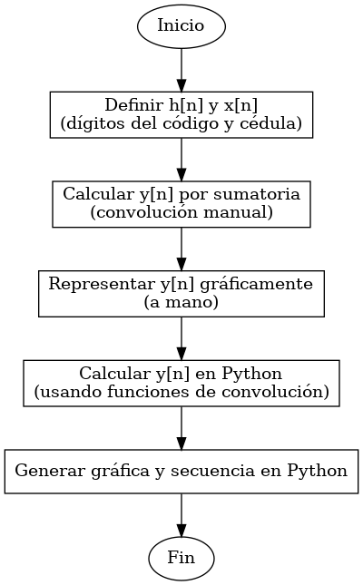
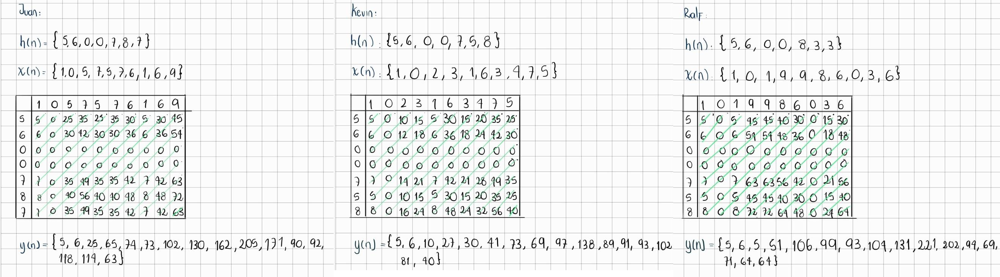
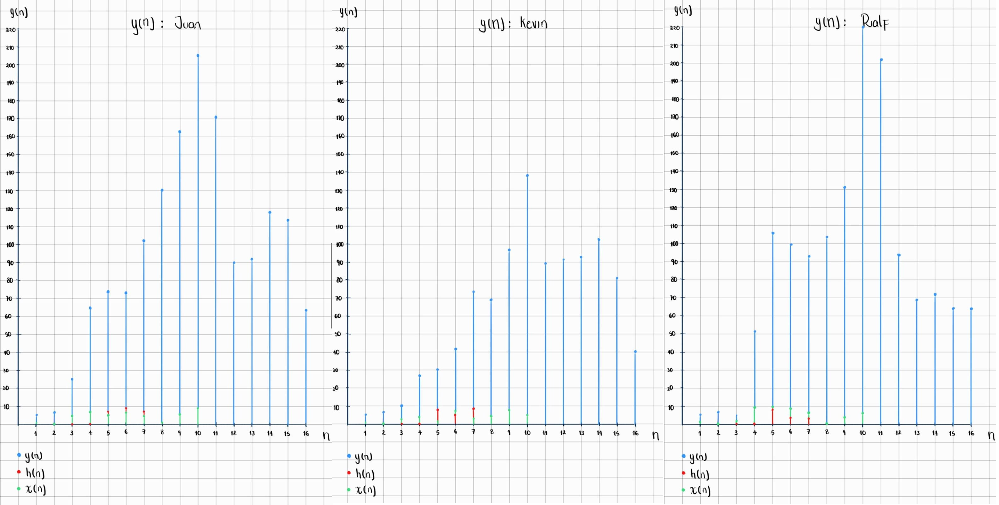

# Laboratorio-2-Procesamiento
## Introducción
En esta práctica de laboratorio se estudiaron tres herramientas fundamentales para el procesamiento digital de señales: la convolución, la correlación y la transformada de Fourier. Estas operaciones permitieron analizar el comportamiento de las señales o conjunto de señales tanto en el dominio del tiempo como en el dominio de la frecuencia. Asimismo, realizamos el análisis de una señal de electrooculografía generada con ayuda del generador biológico de señales. 
## Importación de librerias 
Para el desarrollo de esta práctica se instalaron las siguientes librerías:
```python
!pip install wfdb
import matplotlib.pyplot as plt
import numpy as np
import wfdb
import pandas as pd
import os
from scipy.stats import norm
import seaborn as sea
from scipy.fft import fft, fftfreq
from scipy.signal import welch
```
La librería `wfdb` se utilizó para la lectura y manipulación de las señales biológicas. `Matplotlib` y `Seaborn`  se usaron para la representación gráfica y visualización de datos. `NumPy` y `Pandas` facilitaron el manejo de arreglos numéricos y estructuras de datos. El módulo `os` permitió la gestión de archivos dentro del entorno de trabajo. Asimismo, `scipy.stats.norm` se aplicó para análisis estadístico, mientras que las funciones de `scipy.fft` y `scipy.signal.welch` se usaron para la obtención de la transformada de Fourier, el cálculo de frecuencias y la estimación espectral de potencia de las señales. 
## PARTE A
En la Parte A del laboratorio se trabajó con un sistema discreto h[n] y una señal de entrada x[n], definidos a partir de los dígitos de nuestros códigos y cédulas respectivamente. El objetivo fue aplicar la operación de convolución para obtener la señal de salida y[n]. A continuación, se muestra el diagrama de flujo que describe cada paso de esta parte del laboratorio.
<p align="center">


## Señal y[n] resultante de la convolución:

1. Representación gráfica y secuencial (a mano) de y[n]:
<p align="center">

<p align="center">


2. Representación gráfica y secuencial (en Phyton) de y[n]:

El código que se muestra a continuación, calcula la convolución entre dos señales utilizando la función `np.convolve()` de` NumPy`.

Primero, se definen dos listas, `h[n]` (código) y `x[n]` (cédula), que representan la respuesta al impulso de un sistema y una señal de entrada, respectivamente. Luego, se aplica la convolución entre estas dos señales usando `np.convolve(x, h,)`, lo que genera una nueva señal producto de multiplicar y sumar los valores de las señales iniciales. 

```python
#Definimos h[n] y x[n]

#Juan
h1=[5,6,0,0,7,8,7]
x1=[1,0,5,7,5,7,6,1,6,9]
y1=np.convolve(x1,h1)

#Kevin
h2=[5,6,0,0,7,5,8]
x2=[1,0,2,3,1,6,3,4,7,5]
y2=np.convolve(x2,h2)

#Ralf
h3=[5,6,0,0,8,3,3]
x3=[1,0,1,9,9,8,6,0,3,6]
y3=np.convolve(x3,h3)
```
Ahora para graficar: Inicialmente se generan los índices `n` para que cada punto tenga una posición ordenada en la gráfica, esto con la función `np.arange(len(h1))`. Luego se crea una figura de 8x8 con `plt.figure(figsize=(8,8))`, se hacen tres subgráficas con la función `plt.subplot(3,1,1)` y finalmente se muestran las tres gráficas juntas con `plt.show()`. Se repiten estos pasos dos veces más para obtener las demás gráficas.

```python
#GRÁFICAS JUAN

n1 = np.arange(len(h1))
n2 = np.arange(len(x1))
n3 = np.arange(len(y1))

plt.figure(figsize=(8,8))

#Código: 
plt.subplot(3,1,1) 
plt.stem(n1,h1)
plt.title("Código Juan")
plt.ylabel("Amplitud")
plt.grid(True)

#Cédula: 
plt.subplot(3,1,2) 
plt.stem(n2,x1)
plt.title("Cédula Juan")
plt.ylabel("Amplitud")
plt.grid(True)

#Convolución:
plt.subplot(3,1,3) 
plt.stem(n3,y1)
plt.title("Convolución")
plt.ylabel("Amplitud")
plt.grid(True)

plt.show()

#GRÁFICAS KEVIN
n1 = np.arange(len(h2))
n2 = np.arange(len(x2))
n3 = np.arange(len(y2))

plt.figure(figsize=(8,8))

#Código: 
plt.subplot(3,1,1) 
plt.stem(n1,h2)
plt.title("Código Kevin")
plt.ylabel("Amplitud")
plt.grid(True)

#Cédula: 
plt.subplot(3,1,2) 
plt.stem(n2,x2)
plt.title("Cédula Kevin")
plt.ylabel("Amplitud")
plt.grid(True)

#Convolución:
plt.subplot(3,1,3) 
plt.stem(n3,y2)
plt.title("Convolución")
plt.ylabel("Amplitud")
plt.grid(True)

plt.show()

#GRÁFICAS RALF
n1 = np.arange(len(h3))
n2 = np.arange(len(x3))
n3 = np.arange(len(y3))

plt.figure(figsize=(8,8))

#Código: 
plt.subplot(3,1,1) 
plt.stem(n1,h3)
plt.title("Código Ralf")
plt.ylabel("Amplitud")
plt.grid(True)

#Cédula: 
plt.subplot(3,1,2) 
plt.stem(n2,x3)
plt.title("Cédula Ralf")
plt.ylabel("Amplitud")
plt.grid(True)

#Convolución:
plt.subplot(3,1,3) 
plt.stem(n3,y3)
plt.title("Convolución")
plt.ylabel("Amplitud")
plt.grid(True)

plt.show()
```
En resumen, el código toma una señal de entrada (cédula) y la pasa por un sistema definido por h[n] (código). Luego, mediante convolución, se calcula la salida y todo se grafica. De esto se obtuvieron las siguientes gráficas: 
<p align="center">


